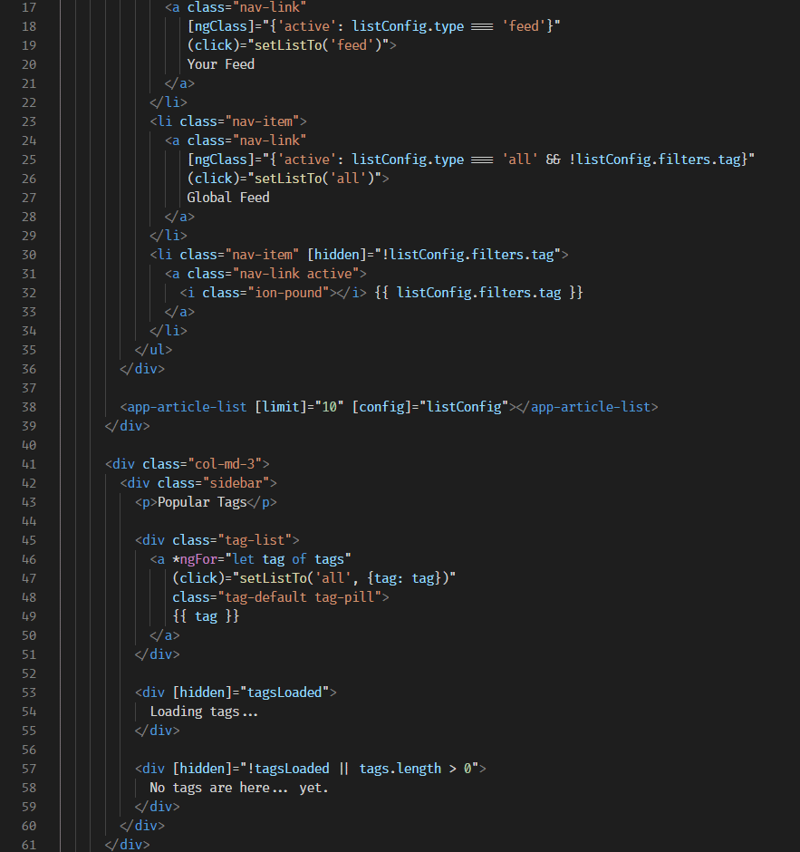
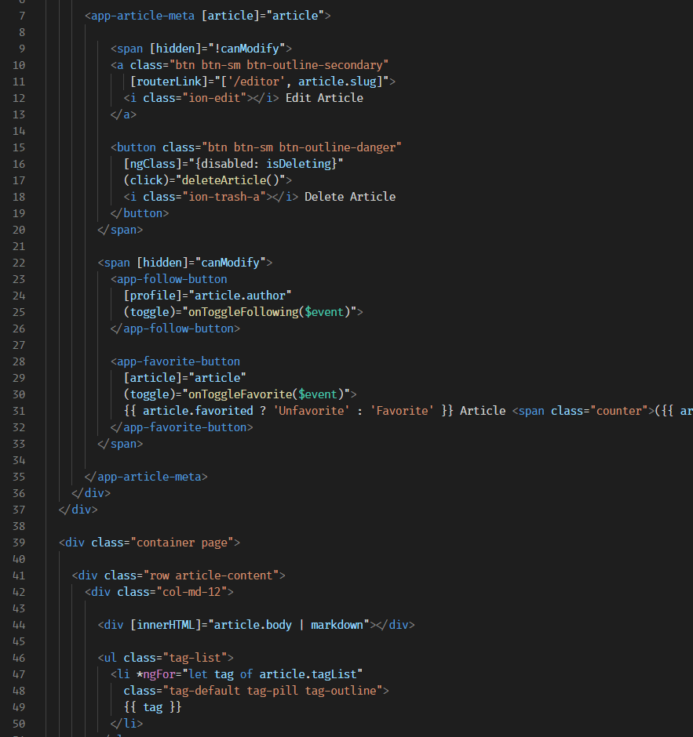
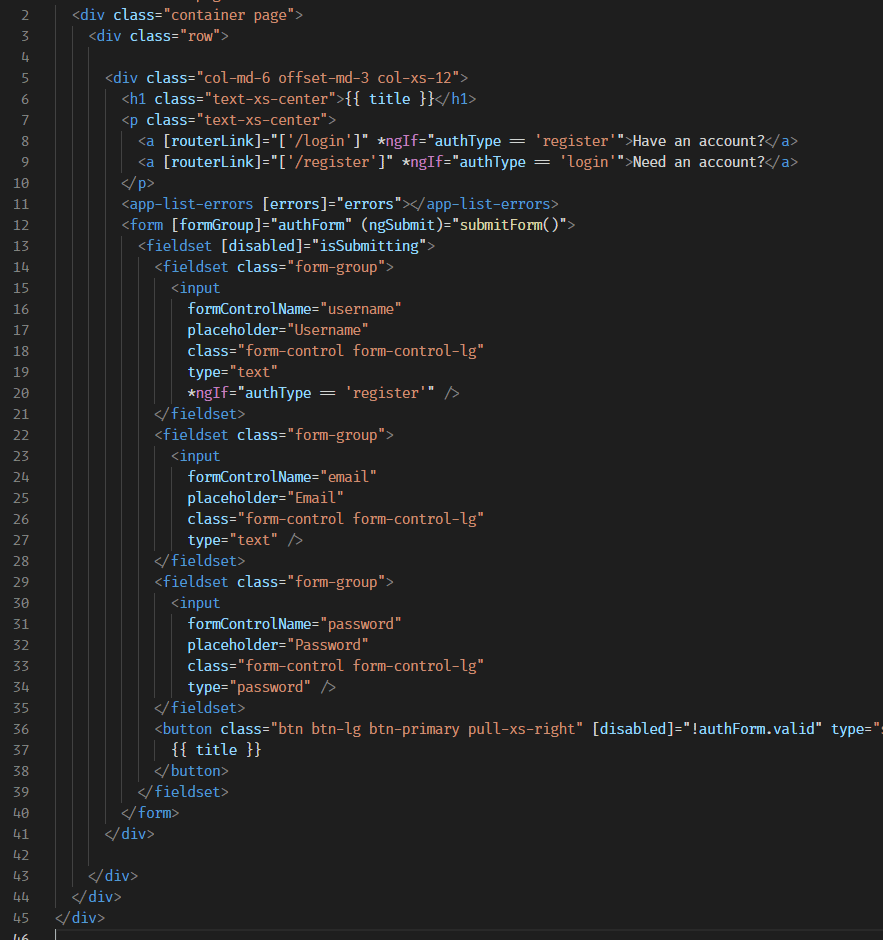

# Angular HTML Syntax

This extension adds tokenization for Angular-specific syntax in HTML template files.

The lack of this feature in VS Code (and lack of a good extension as far as I could find) drove me to WebStorm for a while, but I couldn't stomach the awkward JRE-based text rendering or the extremely limited customization options, so I decided to move back to VS Code and create this extension. Issue reports and pull requests are welcome!

## Features
* `*ngIf` and `*ngFor` attributes on an HTML element are marked as control keywords
* Any HTML attribute enclosed with parens (`()`), brackets (`[]`), or both (`[()]`) are marked as Angular attributes
* Punctuation in Angular attribute names are given their own tokens so they can be colored differently than the attribute name itself
* Values of an Angular attribute are tokenized as embedded JavaScript instead of a string
* Angular interpolation (`{{ }}`) in an HTML tag or attribute value are tokenized as embedded JavaScript
* Uses standard naming conventions for new tokens, so it should work with your favorite theme out of the box

## Screenshots

## A Note on Implementation
Rather than defining "Angular HTML" as a wholly new language with these new features added on, this extension overrides/replaces the default HTML grammar that comes with VS Code.

The advantages are that your Angular template files will continue to benefit from VS Code's HTML language features (like Emmet, autocomplete and snippets), and any productivity extensions you're already using for HTML (like tag auto-closing, auto-renaming, closing tag highlighting, etc.) will continue to work with Angular template files.

Potential disadvantages are that if you *don't want* this extra syntax highlighting in your non-Angular HTML projects (for example, if you're using a library like Mustache or Handlebars whose syntax conflicts with Angular's), you will need to disable this extension for those projects, or selectively enable it only in your Angular workspaces.

## Known Issues
* Embedded JavaScript blocks in Angular template files do not currently benefit from Intellisense or autocomplete

## Limitations
* "Inline" templates defined in a component.ts file (e.g., as a template literal) do not receive any special syntax highlighting. This would require replacing VS Code's [default TypeScript grammar](https://github.com/microsoft/vscode/tree/master/extensions/typescript-basics), and since that grammar receives frequent updates, it would be onerous to keep up to date. If, however, VS Code's contributors or another extension adds recognition of the `template` value in an Angular component as embedded HTML, that embedded HTML block should *theoretically* benefit from the syntax highlighting provided by this extension, since this extension overrides the default HTML grammar.

## License
MIT